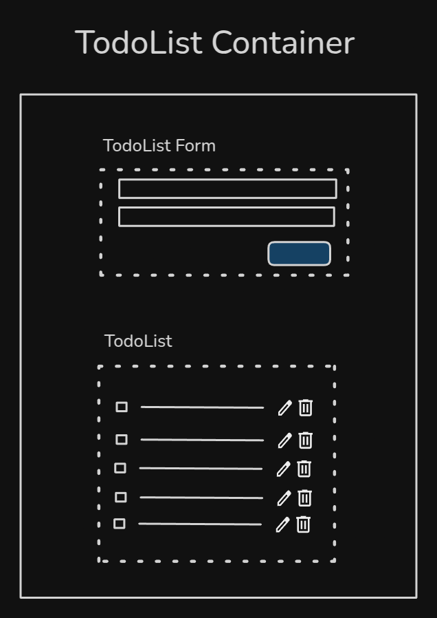

# Diagrama geral de um Todo List

 

<!--
- Implemented a simple Todo List component
- There are three componentes-> TodoList Container, TodoList Form e TodoList
- TodoListContainer -> responsable for interacting with services and manage state
- TodoListForm -> responsable for recieve user interactions throug a form and dispatch actions to parent componente
-TodoList -> responsible to render todo items and dispatch actions to parent

- Architetural explanations

- Everything could be more complex
- Could exist TodoItem Component
- State could be saved at URL
- State management frameworks could be used
- Actions could be dispatched directly to a service (bound comp implementation to a service)
-->
