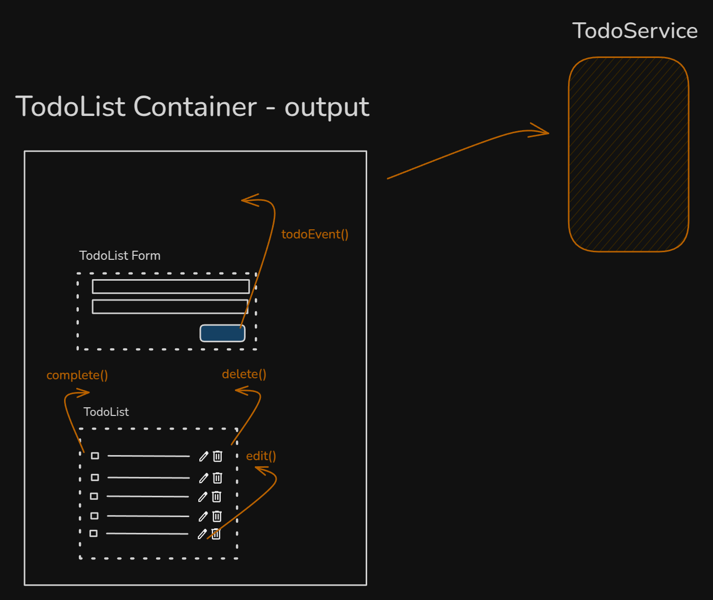

# Outras arquiteturas


````md magic-move
```ts
// TodoListForm.ts
type TodoAction = 'save' | 'edit' | 'delete' | 'complete';

@Component({
  selector: 'app-todo-list-form',
  ...
})
export class TodoListFormComponent {
  #mode = input<TodoAction>();
  #todo = input<Todo | null>();
  #todoEvent = output<{ action :TodoAction, todo: Todo }>();
  
  emitTodo(todo: Todo): void {
    this.#todoEvent.emit({ action: this.#mode(), todo });
  }
```
````
::right::


