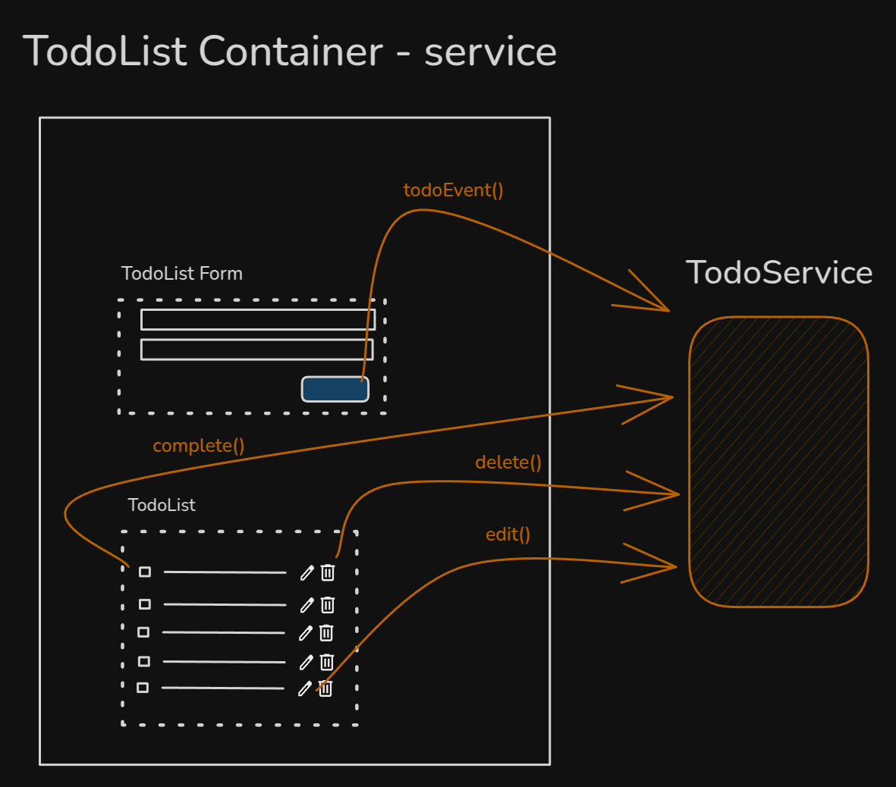

# Outras arquiteturas


````md magic-move
```ts {all}
// TodoListForm.ts
type TodoAction = 'save' | 'edit';

@Component({
  selector: 'app-todo-list-form',
  ...
})
export class TodoListFormComponent {
  readonly #todoService = inject(TodoService);

  saveTodo(todo: Todo): void {
    this.#todoService.saveTodo(todo)
  }

  editTodo(todo: Todo): void {
    this.#todoService.editTodo(todo)
  }
```

````
::right::


